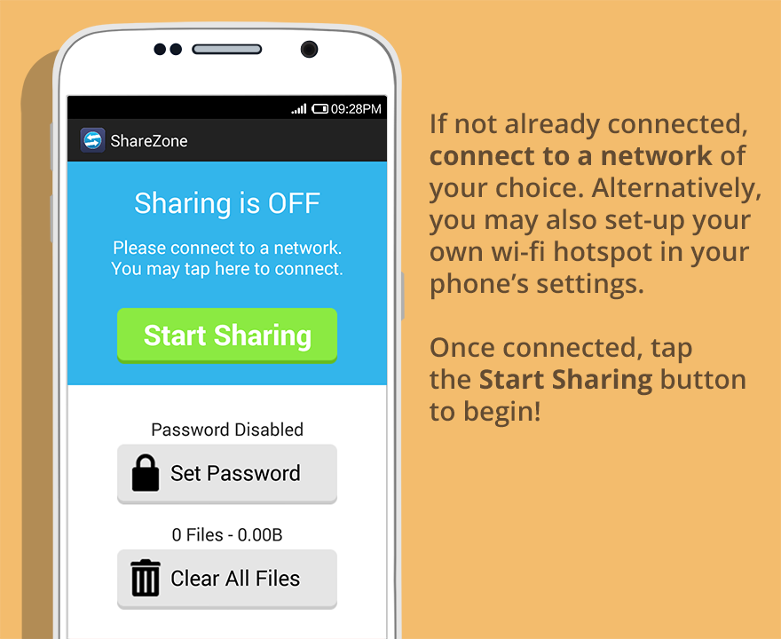
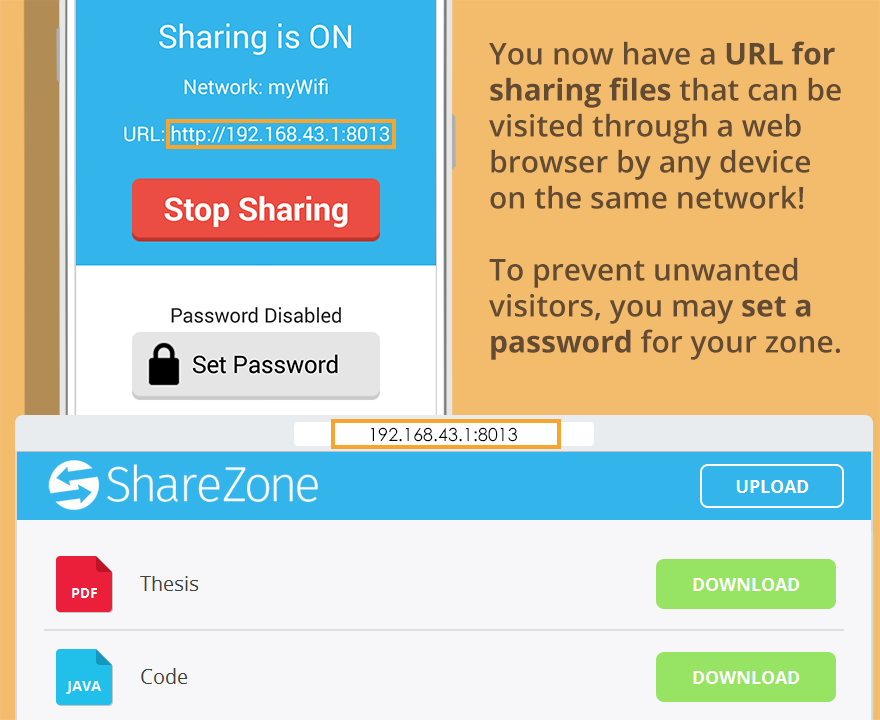
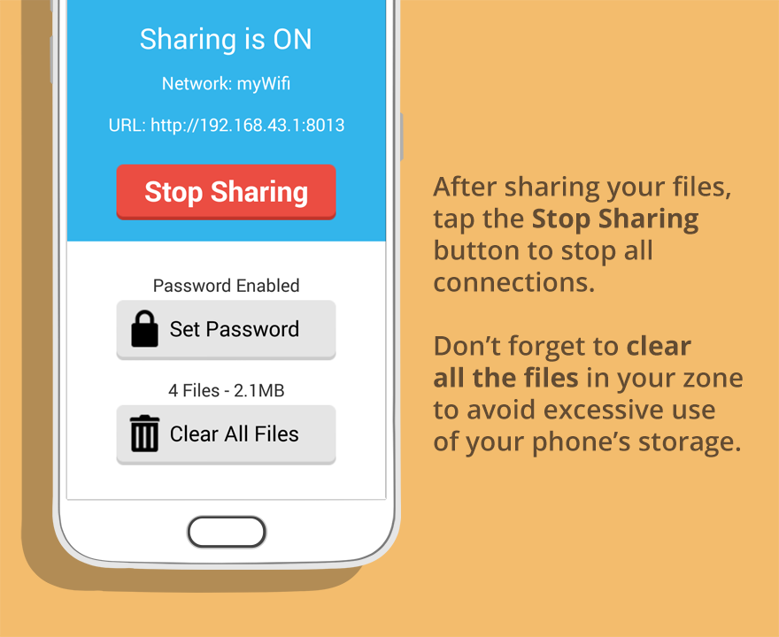

# ShareZone

ShareZone allows you to share and transfer files from 
multiple different devices with each other with just 
a web browser and your smartphone! Gone are the days 
when you needed to carry a USB flash disk around, or 
waste time configuring your device to share a few files, 
or deal with the hassles of installing additional software. 
With ShareZone, you can easily create a hub for 
sharing files accessible from the web browser even without 
an internet connection. Simply tap a button et voila, 
you may now share files with everyone on the network 
by visiting the URL provided for you on their web browser! 
Sharing files has never been this quick and easy!

## Screenshots

## Tech Used
- [android](https://www.android.com/)
- [NanoHTTPD](https://github.com/NanoHttpd/nanohttpd)

## Credits
- **Matthew Go** - Designer & Developer
